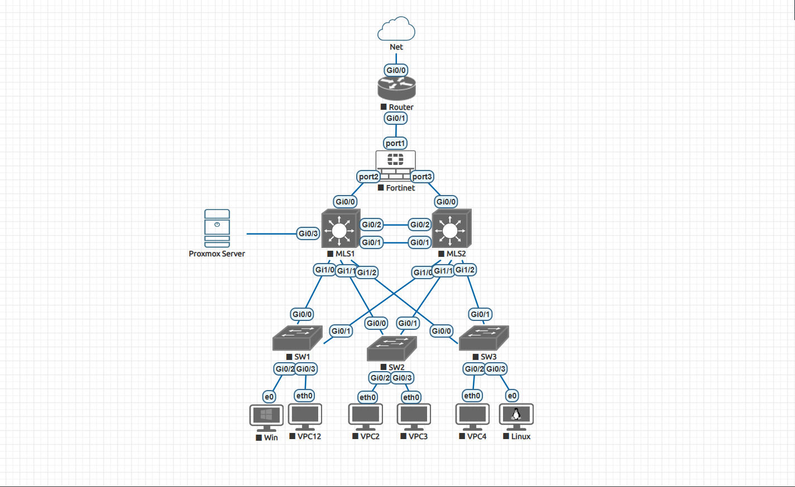

# Enterprise Multi-Tier Network & Infrastructure Architecture Lab 🚀

---

This repository documents the end-to-end design, implementation, and hardening of a multi-tiered, highly available, and secure enterprise-grade hybrid infrastructure. The network core and security boundary are emulated in **EVE-NG**, seamlessly integrated with a physical bare-metal **Proxmox VE** hypervisor host via a physical trunk link.

---

## 📑 Table of Contents
- [Architecture & Topology](#-architecture--topology)
- [Hardware & Hybrid Integration](#-hardware--hybrid-integration)
- [Software & Tooling Stack](#️-software--tooling-stack)
- [Technical Highlights & Security Hardening](#-technical-highlights--security-hardening)
- [Project Roadmap](#-project-roadmap)
- [Detailed IP Addressing Architecture](#-detailed-ip-addressing-architecture)
- [Author & Contact](#-author--contact)

---

## 📐 Architecture & Topology

---

## 💻 Hardware & Hybrid Integration

| Host Device | Deployment Type | Role & Hosted Services | Physical Link |
| :--- | :--- | :--- | :--- |
| **Primary Workstation** | VMware Workstation Pro | Runs **EVE-NG** (Cisco Core/Access Switches, vIOS Edge, FortiGate) | Bridged via Physical Ethernet |
| **Secondary Workstation** | Bare-Metal Hypervisor | Runs **Proxmox VE** (Hosting Windows Server DC & Ubuntu Zabbix) | Linked into EVE-NG **Server VLAN 30** |

---

## 🛠️ Software & Tooling Stack

* **Infrastructure & Security:**
  * **Cisco Systems:** Cisco `vIOS` (Layer 3 Routing) & `vIOS-L2` (Core/Access Switching)
  * **Fortinet:** **FortiGate NGFW** (FortiOS)
* **Compute & Virtualization:**
  * **Hypervisor:** Proxmox VE (Bare-metal deployment via Rufus)
  * **Directory & Monitoring Servers:** Windows Server (AD DS, DNS), Ubuntu Server (Zabbix Node)
  * **Endpoints:** Windows 10 Enterprise & Ubuntu Desktop
* **Operations & Administration:**
  * **Management Interfaces:** Proxmox Web GUI / CLI, FortiGate HTTPS GUI / SSH
  * **Terminal & Access:** PuTTY, MobaXterm (SSH & Console)
  * **File Systems & Artifacts:** WinSCP (Configuration, SCP, Script deployment)

---

## 💡 Technical Highlights & Security Hardening

### 🌐 Routing, Switching & High Availability
* **VLSM Subnet Allocation:** Optimally sized subnets (`/27`, `/28`, `/30`) separating internal departments, management, and server tiers.
* **Layer 3 Core Inter-VLAN Routing:** Global `ip routing` with Switch Virtual Interfaces (SVIs) on `MLS1` and `MLS2`.
* **Dynamic Routing (OSPF Area 0):** Full dynamic routing across Core MLS switches and FortiGate with dedicated `/32` Loopback IDs (`10.10.10.1`–`10.10.10.3`).
* **HSRP Gateway Redundancy:** Active/Standby VIP active state distribution across Core switches with preemption.
* **Rapid PVST+ Alignment:** Spanning Tree Root Bridge primary/secondary roles aligned directly with HSRP active paths.
* **Link Aggregation:** LACP EtherChannel (`Port-Channel 1`) trunks carrying strictly allowed VLANs.

### 🛡️ Layer 2/3 Defense & Security Hardening
* **Unused Interface Isolation:** All inactive ports manually disabled (`shutdown`) and assigned to an isolated blackhole VLAN.
* **VLAN Security:** Dedicated Native VLAN (`VLAN 999`) across all trunk interfaces to mitigate VLAN Hopping.
* **Access Hardening:** `Port Security` (Sticky MACs, strict maximum limits), `BPDU Guard`, and `PortFast` on user ports.
* **Mitigation Protocols:** `DHCP Snooping` and `Dynamic ARP Inspection (DAI)` enforced across untrusted access ports.
* **Edge & Plane Security:** Dynamic NAT/PAT, static upstream default routes (`0.0.0.0/0`), ACLs, Control Plane Policing (CoPP), and Local Credential Encryption with SSH v2.

---

## 🚀 Project Roadmap

* ✅ **Phase 1: Core Network Topology, Dynamic Routing, HA & Security Hardening**

* ⏳ **Phase 2: Active Directory Services, Identity, DNS, DHCP & GPO Integration**
* ⏳ **Phase 3: Centralized Infrastructure Monitoring (Zabbix & Deep Packet Inspection)**
* ⏳ **Phase 4: Disaster Recovery & Automated Enterprise Backup (Veeam)**
* ⏳ **Phase 5: Secure Remote Work (FortiGate SSL-VPN & Multi-Factor Authentication)**

---

## 📝 Detailed IP Addressing Architecture

### 1. VLAN & Redundancy Scheme

| VLAN ID | Subnet / Mask | Department | HSRP VIP | MLS1 Role & SVI | MLS2 Role & SVI | STP Root Status |
| :---: | :---: | :--- | :---: | :--- | :--- | :--- |
| **VLAN 10** | `192.168.1.0/27` | Engineers | `192.168.1.1` | **Active (Pri 110)** - `.2` | **Standby (Pri 100)** - `.3` | MLS1 Primary |
| **VLAN 20** | `192.168.1.32/28` | HR | `192.168.1.33` | **Standby (Pri 100)** - `.34` | **Active (Pri 110)** - `.35` | MLS2 Primary |
| **VLAN 99** | `192.168.1.48/28` | Management (OOB) | `192.168.1.49` | **Active (Pri 110)** - `.50` | **Standby (Pri 100)** - `.51` | MLS1 Primary |
| **VLAN 30** | `192.168.1.96/28` | Server Farm | `192.168.1.97` | **Standby (Pri 100)** - `.98` | **Active (Pri 110)** - `.99` | MLS2 Primary |

> **Native VLAN:** `VLAN 999` (Restricted to Trunk Encapsulation).

---

### 2. Infrastructure & Dedicated Host Assignments

* **Out-of-Band Switch Management (VLAN 99):**
  * `SW1 SVI`: `192.168.1.52/28` | `SW2 SVI`: `192.168.1.53/28` | `SW3 SVI`: `192.168.1.54/28`
* **Server Infrastructure Tier (VLAN 30):**
  * `Proxmox VE Hypervisor Host`: `192.168.1.100/28`
  * `Windows Server (Domain Controller)`: `192.168.1.101/28`
  * `Ubuntu Server (Zabbix Node)`: `192.168.1.102/28`
* **End-User Workstations:**
  * `Windows 10 PC (VLAN 10)`: Static IP in `192.168.1.0/27` range
  * `Ubuntu Linux PC (VLAN 20)`: Static IP in `192.168.1.32/28` range

---

### 3. Point-to-Point Interconnects & OSPF Boundaries (`/30` Subnets)

* **Router IDs:** MLS1 (`10.10.10.1`) | MLS2 (`10.10.10.2`) | FortiGate (`10.10.10.3`) | Edge Router (`10.10.10.4`)

| Link Path | Local Interface & IP | Remote Interface & IP | Subnet |
| :--- | :--- | :--- | :---: |
| **MLS1 ↔ FortiGate** | MLS1 `Gi0/0` (`192.168.1.77`) | FortiGate `port2` (`192.168.1.78`) | `192.168.1.76/30` |
| **MLS2 ↔ FortiGate** | MLS2 `Gi0/0` (`192.168.1.81`) | FortiGate `port3` (`192.168.1.82`) | `192.168.1.80/30` |
| **FortiGate ↔ Edge Router** | FortiGate `port1` (`192.168.1.85`) | vIOS `Gi0/1` (`192.168.1.86`) | `192.168.1.84/30` |
| **Edge Router ↔ WAN** | vIOS `Gi0/0` (`192.168.8.250`) | Upstream ISP Gateway | Dynamic / External |

---

## 👤 Author & Engineer

**Khaled Bazarah**  
*Computer & Network Engineer*  
* **Certification:** Cisco Certified Network Associate (CCNA 200-301)  
* **Accreditation:** Computer Engineer – Saudi Council of Engineers (SCE)  
* 🔗 [LinkedIn Profile](https://www.linkedin.com/in/10khaled-bazarah)
